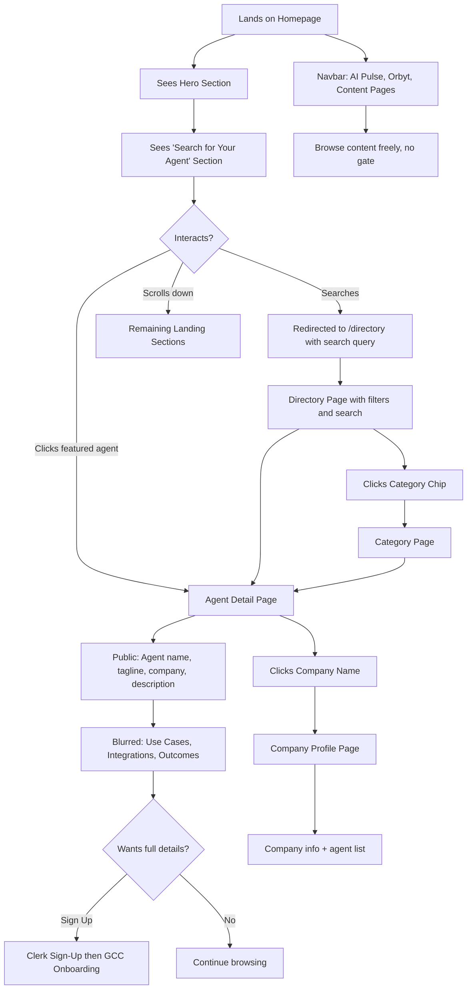
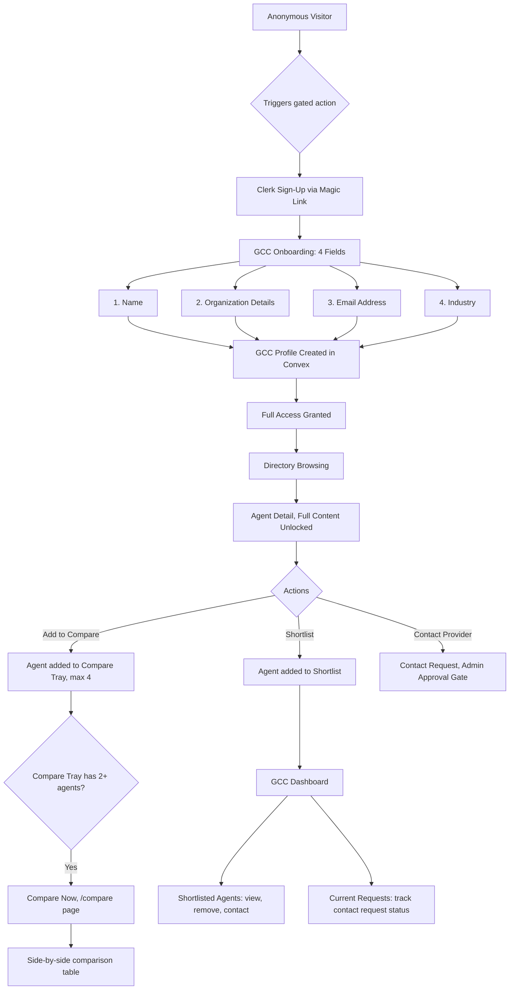
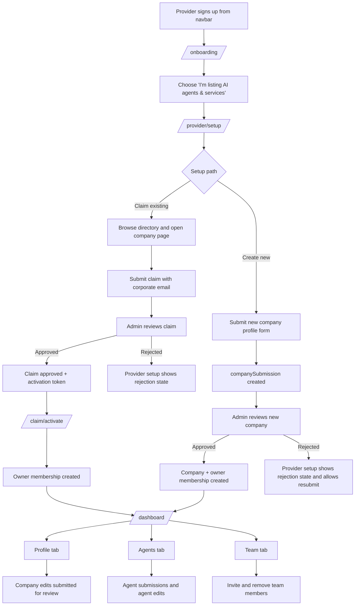
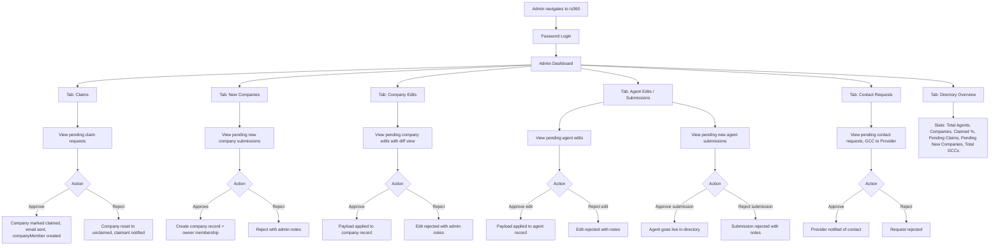
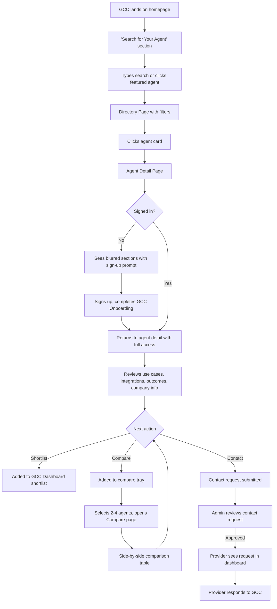
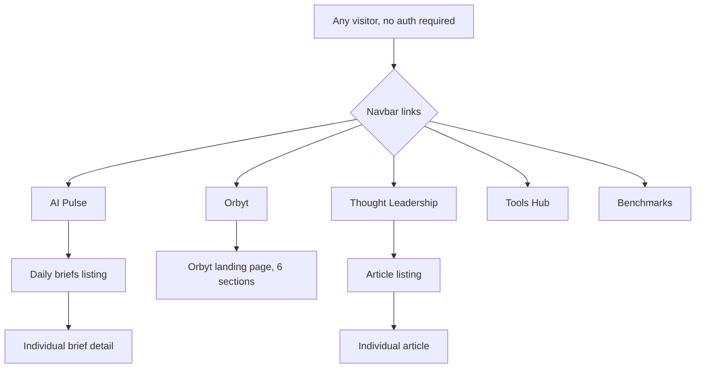

# Persona Flows - Orbys360 Directory Migration

> Review these flows before implementation begins.

---

## 1. Anonymous Visitor Flow

---

## 2. GCC User Flow

---

## 3. Provider Flow (Two Paths)

---

## 4. Admin Flow

---

## 5. End-to-End: Agent Discovery → Contact

---

## 6. Content & Marketing Flows (Unchanged)

